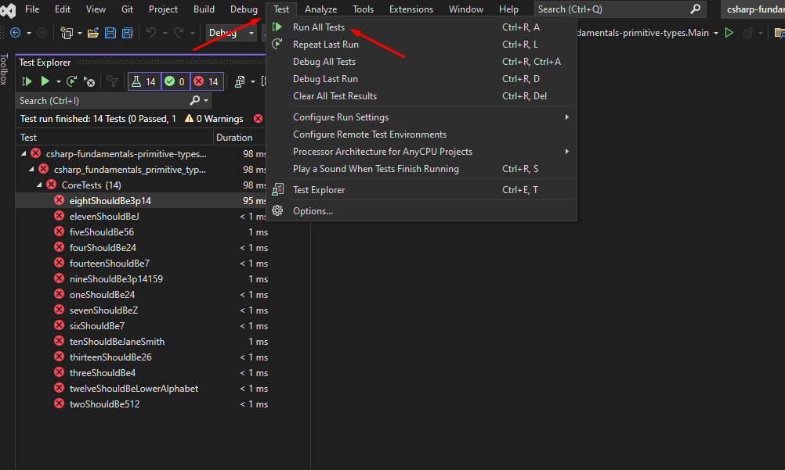

# C# Arrays

## Learning Objectives
- Use arrays to store collections of data

## Set up instructions
- Fork this repository and clone the forked version to your machine
- Open the csharp-fundamentals-arrays.sln solution
- Implement the requirements listed in Core.cs
- When ready to test your solution, open the Test Explorer to run tests.

- If you need to run a single test

## Test Output

When you run a test, it's either going to pass or fail. When it fails, you'll be presented with a big red X next to the test. It is very important to learn to recognize those errors and be able to debug them. 

We can see in the screenshot below that we are failing all of the tests. To check why a test is failing I can click the test that interests me and then at the bottom left we can see that I have a message and a Stack Trace.

The stack trace details in which classes & files the failure happened, and gives you a line number at the end. Most of the lines in the stack trace are irrelevant most of the time, you want to try and identify the files that you're actually working with.

In the sample screenshot below, we've tried to complete the first step of the exercise but provided an invalid value. Then we run the test associated with it and we see a big red stack trace, a test failure.

At the top, we see `expected: 512 but was: 0`. This means the test expected the value to be 512, but the value the student provided was 0.

In the stack trace itself, we see this line: `1.  at csharp_fundamentals_primitive_types.Test.CoreTests.twoShouldBe512() in C:\Dev\boolean\csharp\fundamentals\csharp-fundamentals-primitive-types\src\csharp-fundamentals-primitive-types.Test\CoreTests.cs:line 17`. This is helpful! This tells us the exact line in the `CoreTests.cs` file (line 17) where the failure happened, as well as the method name (twoShouldBe512), helping us to identify where the issue began. This is the kind of thing you need to look for; a relevant file name, method name, class name and line number to give you a good starting point for debugging.

